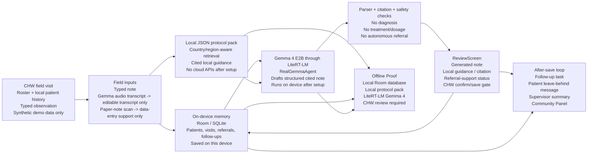

# Smriti System Architecture

Offline maternal-health memory for community health workers

## Safety Boundaries

- Smriti is documentation and referral support, not diagnosis.
- No treatment or dosage advice is generated as a product claim.
- No autonomous referral: the CHW reviews, edits, confirms, and saves.
- No cloud APIs are required after setup for the filmed runtime.
- Audio is transcript-only: it fills an editable transcript and does not save or generate clinical output by itself.
- Vision is data-entry support only: paper-note extraction goes to review and does not diagnose or create a referral from an image alone.
- Demo data is synthetic only.

For README or media gallery use, export this Mermaid diagram to PNG/SVG in a clean phone/product frame. Keep the safety labels visible enough that the visual reads as an offline field product, not a general chatbot.
