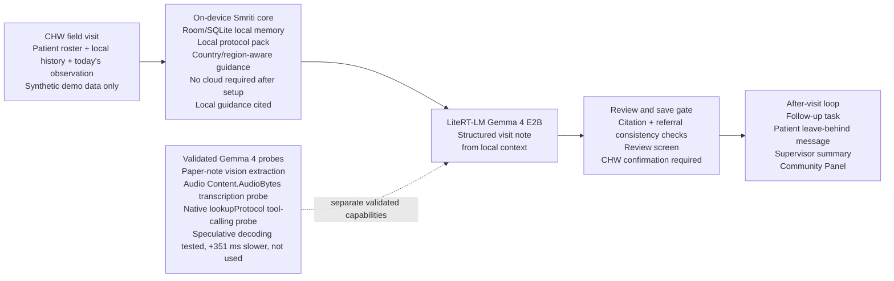

# Smriti System Architecture

Offline maternal-health memory for community health workers

Smriti starts from a CHW's field visit, not an empty chatbot prompt. Local memory and cited guidance shape the Gemma 4 note before the CHW reviews and saves it. The visit closes with follow-up, patient communication, supervisor visibility, and a Community Panel.

For README/media gallery, this Mermaid diagram can later be converted into a visual PNG/SVG.
